# Smart Employee Management System

## 📖 Overview
A modern web application for employee, project, and task management built with Spring Boot (backend) and a React/Vite frontend. It supports JWT authentication, role‑based access, and email notifications.

---

## 🚀 Setup Instructions

### Prerequisites
- **Java 21** (or compatible JDK) installed and `JAVA_HOME` set.
- **Maven 3.9+**
- **Node.js 20+** and **npm**
- **MySQL 8** (or compatible) database server
- **Git** (optional, for cloning)

### Clone the repository
```bash
git clone https://github.com/your-org/smart-employee-project-management.git
cd smart-employee-project-management
```

### Backend (Spring Boot)
1. Create a MySQL database named `sempms`.
2. Run the provided SQL script (see **Database Script** below) to create tables and insert sample data.
3. Configure DB connection in `src/main/resources/application.properties` (username, password, URL).
4. Build and run:
```bash
cd backend
mvn clean install   # resolves dependencies
mvn spring-boot:run   # starts the API on http://localhost:8080
```
   - The server will start on **port 8080**. You should see a log entry like `Started SmartEmployeeProjectManagementApplication`.

### Frontend (React/Vite)
```bash
cd ../frontend   # adjust if the folder name differs
npm install       # install dependencies
npm run dev       # starts dev server, usually http://localhost:3000
```
Open the URL in a browser. The UI will communicate with the backend.

---

## 📂 Database Script
The script below creates the required tables and inserts a few demo users (Priya and Vishnu) with the default password **`Password123`**.
```sql
-- File: db_script.sql
CREATE DATABASE IF NOT EXISTS sempms;
USE sempms;

CREATE TABLE users (
    id BIGINT AUTO_INCREMENT PRIMARY KEY,
    username VARCHAR(50) NOT NULL UNIQUE,
    password VARCHAR(255) NOT NULL,
    first_name VARCHAR(100),
    last_name VARCHAR(100),
    email VARCHAR(150),
    department VARCHAR(100),
    designation VARCHAR(100),
    joined_date DATE,
    status VARCHAR(50),
    employee_id BIGINT
);

CREATE TABLE employees (
    id BIGINT AUTO_INCREMENT PRIMARY KEY,
    first_name VARCHAR(100),
    last_name VARCHAR(100),
    email VARCHAR(150),
    department VARCHAR(100),
    designation VARCHAR(100),
    joined_date DATE,
    status VARCHAR(50)
);

CREATE TABLE projects (
    id BIGINT AUTO_INCREMENT PRIMARY KEY,
    name VARCHAR(200) NOT NULL,
    description TEXT,
    deadline DATE,
    owner_id BIGINT,
    FOREIGN KEY (owner_id) REFERENCES users(id)
);

CREATE TABLE tasks (
    id BIGINT AUTO_INCREMENT PRIMARY KEY,
    title VARCHAR(200) NOT NULL,
    description TEXT,
    status VARCHAR(50),
    assignee_id BIGINT,
    project_id BIGINT,
    FOREIGN KEY (assignee_id) REFERENCES users(id),
    FOREIGN KEY (project_id) REFERENCES projects(id)
);

-- Sample users (password encoded with BCrypt for "Password123")
INSERT INTO users (username, password, first_name, last_name, email, department, designation, joined_date, status)
VALUES
('Priya',   '$2a$10$7QeYQeDg9uYJvasD2bqrUu1kV9bV1KCj90p2QxO/7VfQm1yJzt9U6', 'Priya', 'Kumar', 'priya@example.com', 'Engineering', 'Developer', '2023-01-15', 'ACTIVE'),
('Vishnu', '$2a$10$7QeYQeDg9uYJvasD2bqrUu1kV9bV1KCj90p2QxO/7VfQm1yJzt9U6', 'Vishnu', 'Sharma', 'vishnu@example.com', 'Engineering', 'Developer', '2023-01-15', 'ACTIVE');
```
Save the file as **`db_script.sql`** in the project root.

---

## 📦 Postman Collection
A ready‑to‑import Postman collection is included to test the API endpoints.
- **File:** `sempms_postman_collection.json`
- Import it in Postman → *Import* → *Upload Files*.
- The collection contains example requests for **Login**, **Employees**, **Projects**, and **Tasks**.

---

## 📸 Application Screenshots
### Login Page


---

## 📊 Architecture Flowchart
The following diagram outlines the request flow from the client through authentication, API, and database layers.
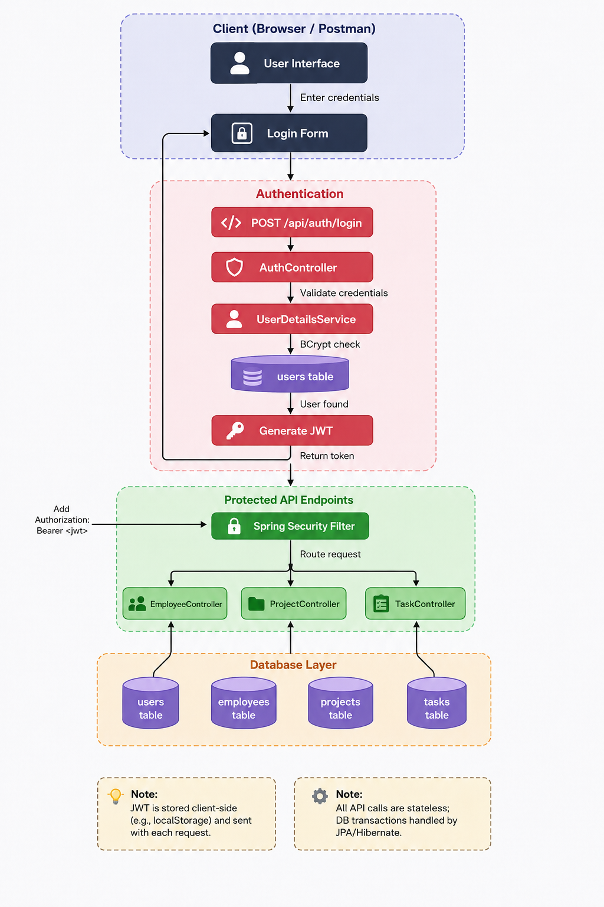

---

## Application Screenshots


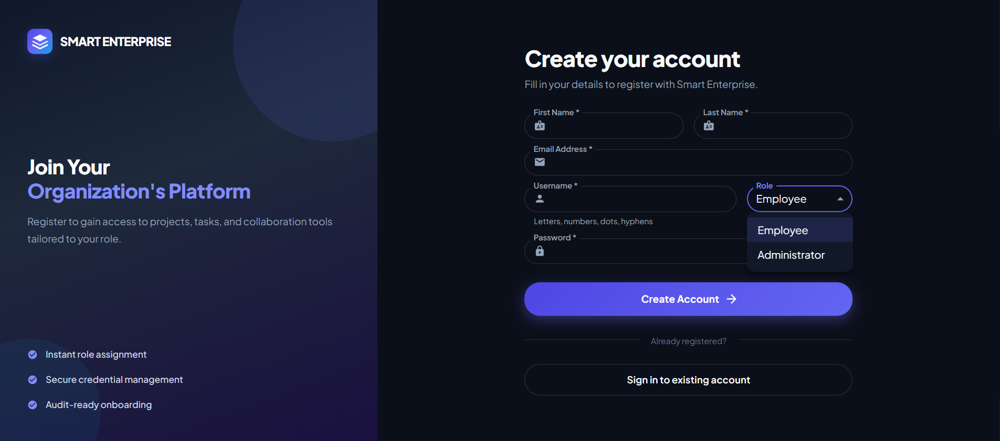
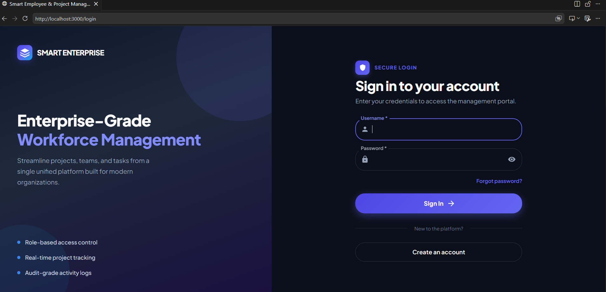
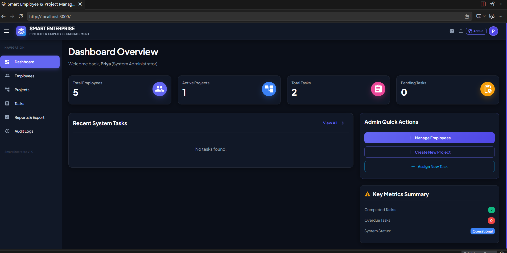
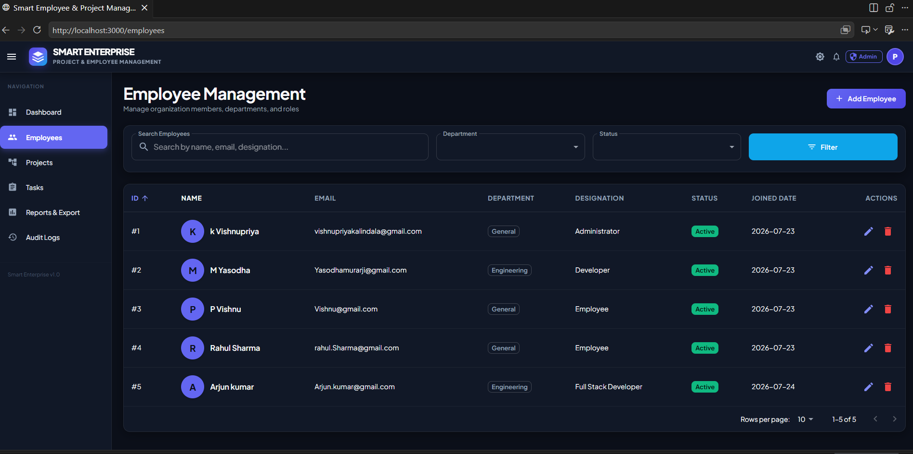
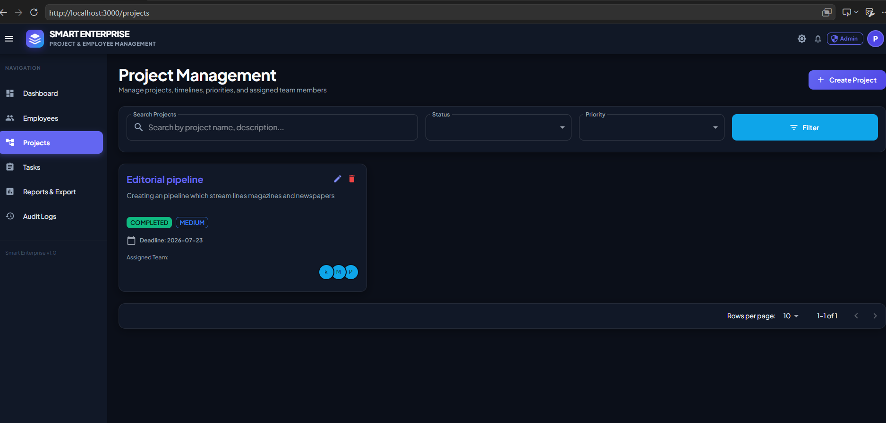
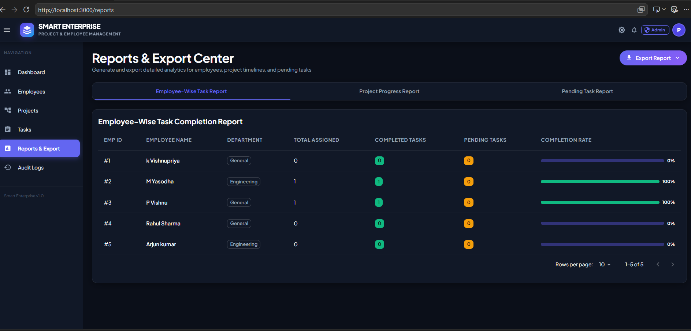
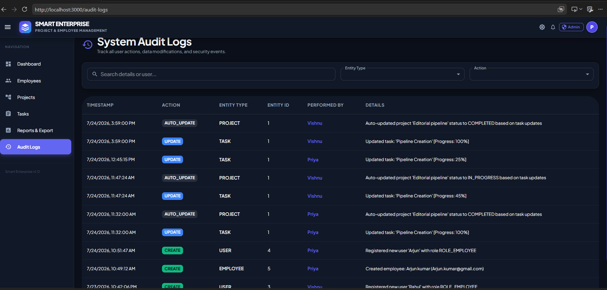
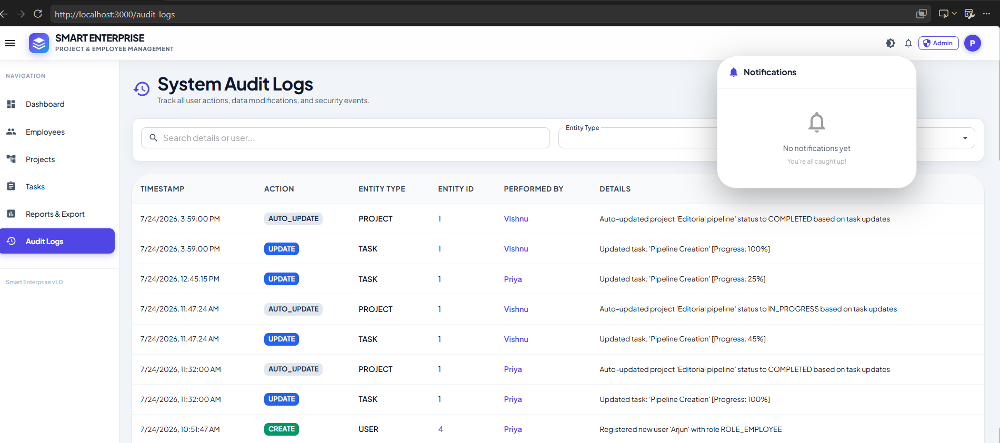
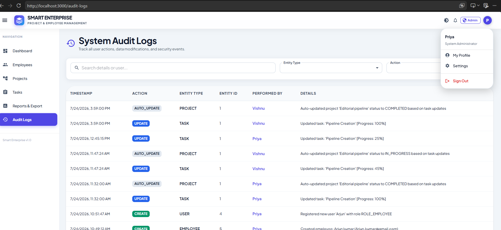
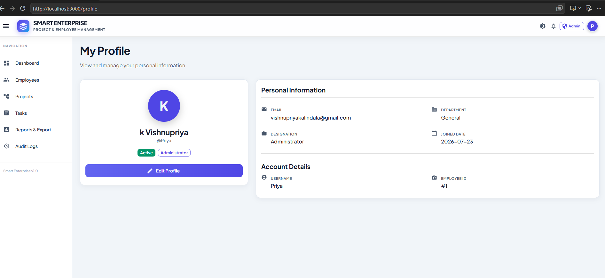
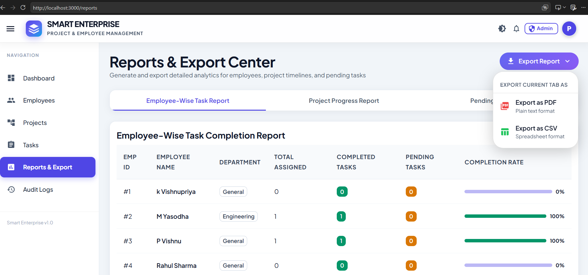
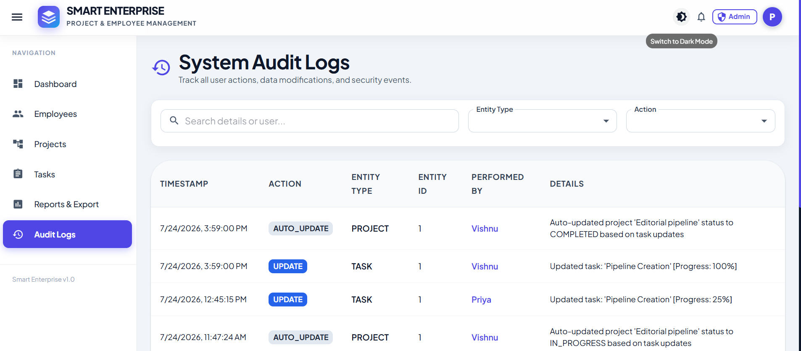
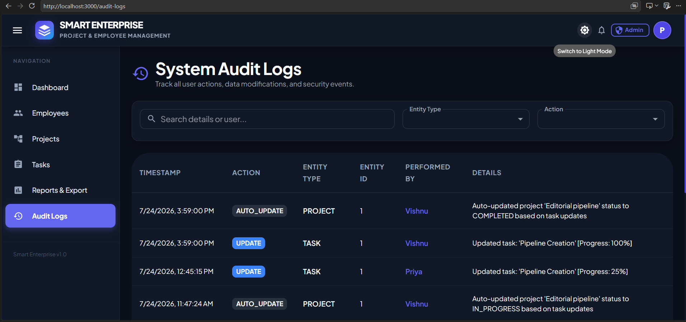

## 🛠️ Running Tests
```bash
cd backend
mvn clean test   # runs all unit & integration tests
```
All tests should pass. The first run will download the required JUnit dependencies.

---

## 🤝 Contributing
1. Fork the repository.
2. Create a feature branch (`git checkout -b feature/awesome-feature`).
3. Commit your changes and push.
4. Open a Pull Request.

---

## 📄 License
MIT License – see `LICENSE` file for details.
